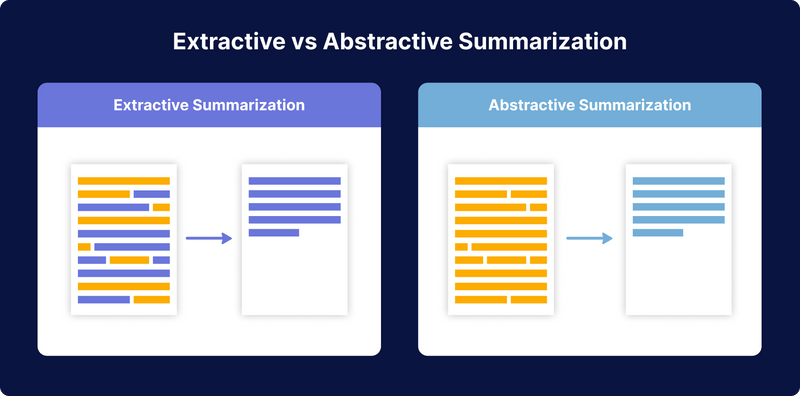

# Section no2 - Summarization

## Definition

> Definition: A summary is a short version of a text. It should be is a concise version of the original text.

### Traditional approaches (Extractive summarization)

- Extractive summarization is the task of automatically selecting a subset of words from the input document to construct a summary.
- The main idea is to identify the most important sentences or phrases from the original text and extract only those from the text.
- The extracted sentences are then combined to form a summary.
- The advantage of this approach is that the summary can be easily constructed by just combining the extracted sentences in the order they appear in the text.
- The disadvantage is that the summary may not be very coherent.

### Deep learning approaches (Abstractive summarization)

- Abstractive summarization is the task of generating a summary from the input document without the constraint of copying words or phrases from the original text.
- The main idea is to generate new phrases and sentences that relay the most important information from the original text.
- The advantage of this approach is that it can generate more fluent summaries.
- The disadvantage is that it is more difficult to train a model to generate coherent summaries.

### Example

Prompt:

> Write a concise summary of the following:
> 
> The bright sun shines in the clear blue sky, casting warm rays that make the green grass sparkle and the colorful flowers bloom, while happy birds chirp and flutter around the tall trees, creating a peaceful and serene atmosphere.
>
> ----
> Prompt Words: 46
> Sentence Words: 39

Response:

> Sunny day: Clear sky, vibrant colors, chirping birds, serene ambiance.
>
> ----
> Words: 10 ~ 25% of the original text

### LLM Visualization

- Present [LLM Visualization](https://bbycroft.net/llm)
- Talk about tokens

## Test with Playground

- Navigate to [OpenAI Playground](https://platform.openai.com/playground?mode=chat&model=gpt-3.5-turbo)
- Explain Model Parameters
  - Temperature: Controls the randomness of the predictions. Lower temperature results in less random completions. As the temperature approaches zero, the model will become deterministic and repetitive. Higher temperature results in more random completions.
  - Maximum length: Controls the maximum length of the predicted completion. It is measured in tokens and includes the length of the context. (one token is roughly 4 characters for normal text)
  - Stop sequence: Controls the stop sequence. The model will stop generating further tokens when this sequence is encountered.
  - Top p: Controls diversity via nucleus sampling: 0.5 means only the top 50% of the probability mass will be considered at each step. 1.0 means all possibilities are considered.
  - Presence penalty: The scale of the penalty applied if a token is already present at a given sequence step.
- Test with [article.html](./scripts/article.html) example
  - Set the parameters: temperature = 0.7, max length = 300, top p = 1.0, presence penalty = 0.0
  - Evaluate the result

## Code Implementation

- Simple implementation using [openai](https://www.npmjs.com/package/openai) sdk
- Explain (./scripts/summarization.js)
- Run `node ./scripts/summarization.js` to test the script
- Evaluate the result
- Run `node stats.js` to get the stats
- Challenges with the openai sdk approach
  - Handle Token limit
  - Conversation flow
  - Prompt Templates
  - Vendor lock-in

## Improvements

- Navigate to https://platform.openai.com/tokenizer
- HTML to text conversion - less tokens
- Test different models (GPT-4)
- Test different parameters
- Test different prompts

## LangChain.js vs OpenAI

- Introduce [langchainjs](https://www.npmjs.com/package/langchain)
- Langchainjs is a framework for building applications that use NLP models to process text.
- It provides a simple interface for building applications that use NLP models to process text.

### Solution Comparison

| OpenAI                    | LangChain.js              |
| ------------------------- | ------------------------- |
| Limited to OpenAI models  | Supports multiple models  |
| Low level abstraction     | High level abstraction    |
| Instant Access Latest API | Community driven adoption |